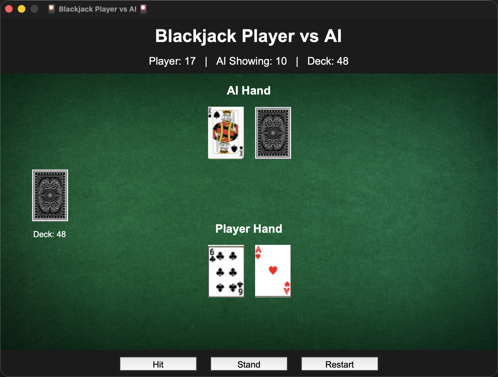

# 🎴 Blackjack Player vs AI  
A desktop Blackjack game built with **Python**, **Tkinter**, **PIL (Pillow)**, and **Pygame**.  
Smooth UI, card animations, sound effects, AI decision-making, and full deck simulation.

---

## 📸 Screenshot

*(Replace with your screenshot or rename the image to match.)*

---

## 🎮 Features

### 🔹 Core Game Mechanics
- Full 52-card deck (auto-shuffled)
- Accurate Blackjack scoring (including Ace as 1 or 11)
- Player vs AI dealer
- Hit / Stand actions
- **Five-Card Charlie rule**
- Auto-detection of Blackjack at game start

### 🔹 AI Dealer Behavior
- AI hits while hand < **14**
- AI stops at safe totals
- AI supports:
  - Bust detection  
  - Blackjack  
  - Five-card charlie  
  - Smart comparison logic  

### 🔹 Visual & Audio Enhancements
- Smooth card layout on canvas
- Real card images (`images/*.jpg`)
- High-quality sound effects:
  - `hit.wav`
  - `win.wav`
  - `lose.wav`
- Background table image

### 🔹 GUI
- Clean dark-themed interface
- Displays:
  - Player score  
  - AI showing card  
  - Deck size  
- Restart button to reset entire game  

---

## 🗂 Folder Structure

📦 Blackjack-Game
┣ 📂 images
┃ ┣ 2C.jpg, 2D.jpg, ..., AS.jpg
┃ ┣ back.jpg
┃ ┗ bg.jpg
┣ 📂 sounds
┃ ┣ hit.wav
┃ ┣ win.wav
┃ ┗ lose.wav
┣ main.py (your game file)
┗ README.md

yaml
Copy code

Make sure you have:
- **52 card images**
- **back.jpg**
- **bg.jpg**
- **3 sound files**

---

## 🛠 Installation

### 1️⃣ Install Dependencies
pip install pillow pygame

shell
Copy code

### 2️⃣ Run the Game
python main.py

yaml
Copy code

---

## 🧠 How the Code Works (Detailed Explanation)

This project contains three major parts:
🃏 Blackjack Game (Tkinter + Python)
====================================

A polished, feature-rich Blackjack game built with Python, Tkinter, Pillow, and Pygame.Includes card rendering, sound effects, restart system, and simple AI logic.

🎴 Card System
--------------

Each card is represented as:

(rank, suit, value, image\_filename)

Example:("K", "S", 10, "KS.jpg")

Ace handling logic:

while total > 21 and aces:total -= 10aces -= 1

🖥️ Graphical User Interface
----------------------------

• Game title• Player / AI scores• Canvas for table and cards• Buttons: Hit, Stand, Restart• Deck displayed on the left side• AI’s second card hidden (back.jpg) until the game ends

Layout:

| AI CARDS || || \[Deck\] (Table) || || PLAYER CARDS |
------------------------------------------------------

🎮 Game Logic
-------------

### Player Turn

• Hit (max 5 cards)• Stand• Automatic detection:

*   Bust (>21)
    
*   Five-Card Charlie
    
*   Exact 21
    

### AI Turn

AI draws while:

score < 14ANDAI has less than 5 cards

### End Game

end\_game():• Locks buttons• Reveals AI hidden card• Plays sound• Shows popup result

🔄 Restart System
-----------------

on\_restart() resets the entire game:

• Deck• Player hand• AI hand• Canvas• Scoreboard• Buttons

🔊 Sound System
---------------

Uses Pygame mixer:

pygame.mixer.Sound(path).play()

Wrapped with play\_sound() so missing sound files never crash the game.

📦 Requirements
---------------

Install dependencies:

pip install pillow pygame

Tkinter is included with Python.

🚀 Future Improvements
----------------------

• Smooth card animations• Betting and chips• Smarter AI• Multi-round scoring• Leaderboard

🤝 Contributing
---------------

Pull requests are welcome!Improve UI, animations, or AI logic.

📜 License
----------

MIT License — free to use and modify.

🎉 Enjoy the Game!
------------------

If you like this project, please ⭐ star the GitHub repo!
